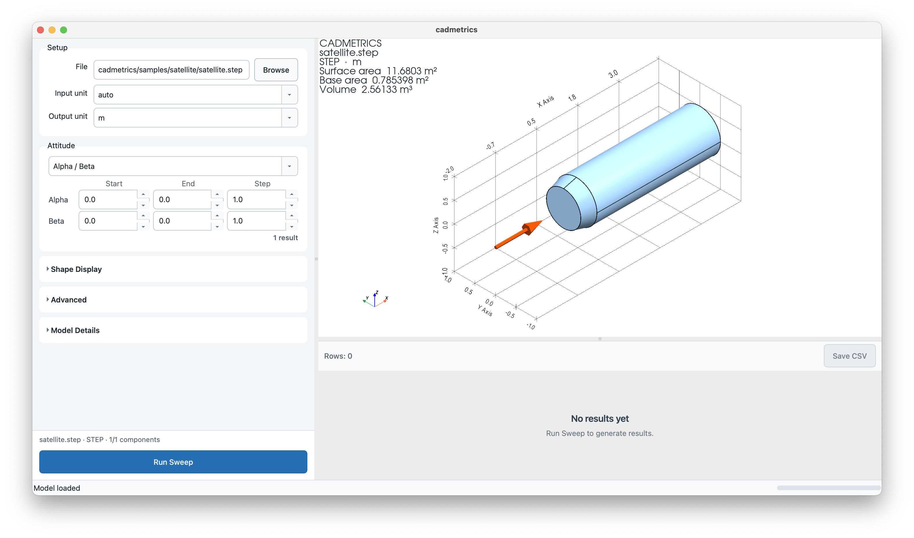

# GUI Usage

The PySide6 GUI is a local desktop tool for loading STL or STEP geometry, checking the shape,
running projected-area sweeps, and saving CSV results.

## Install

Install the GUI extra:

```bash
pip install "cadmetrics[gui]"
```

Install STEP support and the GUI together:

```bash
pip install "cadmetrics[step,gui]"
```

From a development checkout:

```bash
uv sync --extra step --extra gui
uv run cadmetrics-gui
```

## Launch

```bash
cadmetrics-gui
```

If using the local macOS helper app from the repository root:

```bash
open dist/Cadmetrics.app
```

## Screenshot



The screenshot shows the default workflow: a STEP sample loaded in the 3D view, the advanced
axis/tessellation controls collapsed, an alpha sweep configured, and the results area below the
viewer.

## Basic Workflow

1. Click `Browse` and choose one or more STL files, or one or more STEP files.
2. Confirm input and output units.
3. Adjust tessellation settings if needed.
4. Choose the attitude input mode.
5. Run `Run Sweep`.
6. Select rows in the result table to update the camera and overlay.
7. Save results with `Save CSV`.

The selected geometry is loaded and displayed immediately after browsing. When multiple files are
selected, the GUI treats them as one calculation model. STEP and STL files cannot be mixed in the
same selection.

After a model is loaded, `Run Sweep` reuses the displayed geometry instead of loading the same
file again. Changing Advanced settings that affect geometry still reloads the model when those
settings are applied.

## Setup

`Input unit` defaults to `auto`.

- STEP files: unit is read from the file
- STL files: unit is assumed to be meters

`Output unit` controls displayed and exported length, area, and volume units.

## Advanced

`Advanced` is collapsed by default because these settings are usually changed less often.
Expand it when the loaded CAD axes, component selection, STEP metric source, or tessellation
settings need adjustment. Changes in this section are applied together with `Apply Settings`.

### Axis Map

`Axis map` remaps the loaded model axes before calculation and display. Choose which input axis
becomes cadmetrics `X`, `Y`, and `Z`. Use signs such as `-Z` when an axis is reversed. Changing
the combo boxes does not reload the model immediately; click `Apply Settings`, browse a file,
or run a calculation to use the new mapping.

### Component Filters

For multi-solid STEP files, `Components` lists the loaded solid components. cadmetrics uses
STEP/XCAF names when they are available and falls back to `Component 1`, `Component 2`, and so
on when a useful name is not stored in the file. Clear a component checkbox to exclude that
solid from the displayed model and subsequent calculations, then click `Apply Settings`.

The filters operate on STEP solid geometry after loading and before boolean union. Keeping all
components enabled preserves the default behavior. For multi-file STEP assemblies, components are
grouped by file name and share one global index sequence. STL component filtering is not
supported.

Saved CSV results include `step_components` and `step_component_names`, so calculations can be
traced back to the component checkboxes that were enabled.

### Tessellation

`STEP metrics` controls how STEP volume and surface area are calculated:

- `B-Rep`: default CAD-kernel values
- `Mesh`: values calculated from the tessellated mesh, useful for STL-like comparisons

`Mesh deflection` controls STEP tessellation used for projected-area calculations. `Auto`
is enabled by default and uses:

```text
bounding-box diagonal * 1e-4
```

`Angular deflection` controls STEP angular tessellation tolerance. Its default is `0.1`.

`Base tolerance` controls how close a face must be to cadmetrics-coordinate `Xmax` to count as
`base_area`. It is relative to the loaded model size: cadmetrics uses
`max(bounding-box diagonal * value, 1e-12)` in the output length unit. The default is `1e-6`.

## Shape Display

The 3D view supports:

- transparent shape display
- mesh-edge display
- feature-edge display
- projection-arrow display (enabled by default)
- optional yellow highlighting of the Xmax base face
- camera direction selection from `+X`, `-X`, `+Y`, `-Y`, `+Z`, `-Z`, and two ISO views
- overlay text with current conditions or selected result values
- PNG export with `Save Image`

The viewer uses parallel projection. After a calculation, selecting a result row points the
camera along that row's projection direction.

## Documentation Viewer

Choose `Help` > `Documentation` to open the README and all bundled documentation as a local MkDocs
site in the system's default browser. The site works offline and provides navigation between all
bundled documents.

## Attitude Input

The GUI supports three input modes:

- `Alpha / Beta`: sweeps angle of attack and sideslip
- `Roll / Pitch`: sweeps roll and pitch
- `Unit vector`: calculates one explicit projection direction

Angle modes use separate `Start`, `End`, and `Step` fields. The sweep calculates every
combination of the selected angle ranges. Unit-vector mode does not sweep.

See [Attitude Definition](attitude.md) for the coordinate convention and formulas.

## Results

The result table uses the same columns as the CLI CSV output. Important fields include:

- `x_min`, `x_max`, `y_min`, `y_max`, `z_min`, `z_max`
- `surface_area`
- `base_area`
- `volume`
- `projected_area`
- `centroid_u`, `centroid_v`
- `centroid_x`, `centroid_y`, `centroid_z`
- `alpha_deg`, `beta_deg`
- `roll_deg`, `pitch_deg`
- `direction_x`, `direction_y`, `direction_z`
- `cadmetrics_version`, `cadmetrics_hash`
- `base_tolerance`

The yellow centroid marker is shown when a projected-area result row is selected. The red
projection arrow is placed outside the model and aligned with the selected projected centroid
when available.

## Current Scope

The GUI supports one combined calculation model at a time. When multiple files are loaded, they
are displayed as one combined model rather than as separately styled model objects.

Geometry repair is out of scope for cadmetrics. Repair invalid CAD or mesh geometry in a CAD/mesh
tool before loading it.
