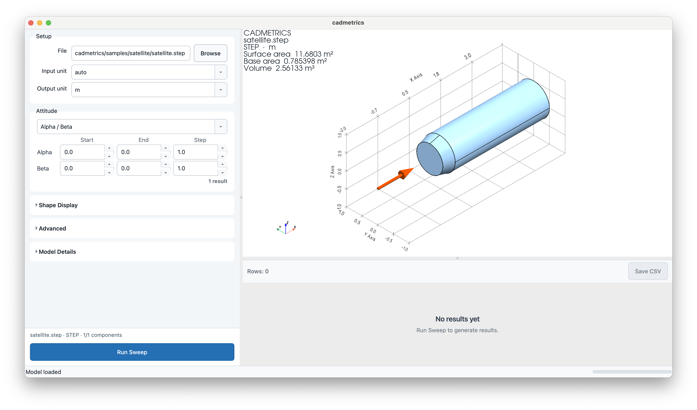

# GUI Usage

The PySide6 GUI is a local desktop tool for loading STL or STEP geometry, checking the shape,
running projected-area sweeps, and saving CSV results.

## Install

Install the GUI extra:

```bash
pip install "cadmetrics[gui]"
```

Install STEP support and the GUI together:

```bash
pip install "cadmetrics[step,gui]"
```

From a development checkout:

```bash
uv sync --extra step --extra gui
uv run cadmetrics-gui
```

## Launch

```bash
cadmetrics-gui
```

To build the local macOS helper app, install the development GUI dependencies and use a Mac with
Xcode Command Line Tools (`xcrun clang`). From the repository root:

```bash
uv sync --extra step --extra gui
.venv/bin/python scripts/create_macos_app.py
open dist/Cadmetrics.app
```

The generated app is a development helper tied to its checkout and Python environment, not a
standalone distribution. Its native executable loads CPython without replacing the process, which
retains the macOS app PID used by accessibility clients such as Computer Use. It runs the ordinary
`cadmetrics-gui` entry point; numerical calculations and the installed CLI are unchanged.

Each launch discovers the Python shared library again. The checkout's executable
`.venv/bin/cadmetrics-gui` selects `.venv/bin/python`; otherwise `uv run python` discovers the
environment and its GUI entry point. Install the GUI extras first: the fallback does not add extras
or change the existing `uv run` synchronization policy. `sys.executable` remains the real selected
interpreter so Python subprocesses and spawn workers use that environment. The uv fallback also
propagates uv's PATH and VIRTUAL_ENV into the GUI process. The launcher sets the
checkout working directory, preserves the previous PATH prefix and inherited display environment,
forwards command-line arguments (except macOS `-psn_` arguments), and returns Python's exit status.

The app stores a relative checkout location in its resources. Moving the checkout together with
its `dist` app preserves that location relationship; it does not make the Python environment
portable. Follow the environment recovery below after moving a checkout. After moving only the
app or checkout, or changing the launcher sources, rebuild the app as well. `--output` and
`--bundle-id` are supported for isolated diagnostic builds. Compilation is
completed in a temporary directory before publishing the bundle. An existing app is refused by
default; close it before explicitly replacing it:

```bash
.venv/bin/python scripts/create_macos_app.py --replace
```

For Computer Use, launch with the relative `open` command above and select the app by its absolute
path. Distinguish startup errors in stderr from app identification or Qt accessibility errors. A
successful process launch alone does not verify the visible GUI. Missing runtime/library/entry
point errors should be resolved by preparing the environment and rebuilding, without changing
macOS security settings.

### Moving a development checkout

Recreate the Python environment at the new location before launching the helper. Normal `uv sync`
installs this project in editable mode, with an absolute source path in a site-packages `.pth` file.
Moving `.venv` preserves that old path and can also leave stale script interpreter paths. Even if
`macos_runtime.py` finds the Python library and executable GUI script, the entry point can fail to
import the product's GUI modules. The existing executable still selects the venv-first route;
runtime discovery
does not check product imports and does not trigger uv synchronization on that route.

Close the app and deactivate any previously activated environment. From the **moved checkout root**,
use a shell without a custom `UV_PROJECT_ENVIRONMENT` override. Preserve the old environment in a
uniquely named backup, then recreate and reinstall the locked STEP/GUI environment:

```bash
previous_env=$(mktemp -d .venv-before-move.XXXXXX)
mv .venv "$previous_env/venv"
uv sync --locked --extra step --extra gui --group dev
.venv/bin/python -I -c 'import cadmetrics; print(cadmetrics.__file__)'
.venv/bin/python -I -c 'from importlib.metadata import distribution; e = next(e for e in distribution("cadmetrics").entry_points if e.name == "cadmetrics-gui"); print(e.load())'
.venv/bin/python scripts/create_macos_app.py --replace
open dist/Cadmetrics.app
```

The first check must print `src/cadmetrics/__init__.py` under the **new** checkout. The second must
load the GUI entry-point function. The rebuild uses the new environment; `--replace` requires the
existing app to be closed. Keep the backup until the new environment works. These commands target
the default `.venv`; creating a portable environment or automatically repairing it at launch is
outside this development helper's scope. See the [Python virtual-environment portability notes](https://docs.python.org/3.12/library/venv.html#how-venvs-work)
and [uv editable-install documentation](https://docs.astral.sh/uv/concepts/projects/sync/#editable-installs).

To reproduce the failure and recovery with the real committed source in a fresh scratch directory:

```bash
.venv/bin/python scripts/verify_editable_move.py --workspace /tmp/cadmetrics-editable-move-check
```

Choose a workspace that does not already exist. The script performs actual locked editable installs,
moves the old checkout out of reach, records successful runtime discovery followed by the actual
GUI script's import failure, and checks the recovered module path and GUI entry-point import.
On macOS it also builds the native helper and checks its pre-recovery import failure. Its report
explicitly distinguishes these checks from real-screen GUI interaction. The native process tests
in `tests/test_macos_launcher.py` use a self-contained probe to check relative bundle location,
PID, argv, spawn, environment and exit status after a move; they do not import the product or prove
that an unchanged editable environment can launch it.

### macOS result selection

Qt 6.11.1 on macOS 27.0.1 can crash in Cocoa's `accessibilitySelectedChildren` when a whole result
row is selected. This was reproduced with the native launcher and with a standalone standard Qt
table, independently of CAD loading or calculations. Keeping a valid native app PID addresses app
identification; the table crash needs its own workaround.

On macOS, the results view keeps one native selected cell and paints the current row with the usual
full-row highlight. Clicking cells or using the arrow keys still chooses the corresponding result,
updates the preview and camera, and saves every result column to CSV. Linux and Windows retain
native whole-row selection. This avoids the observed multi-cell enumeration path while retaining
accessibility; it is not a general fix for Qt accessibility lifetime defects. Other Qt/macOS
combinations still require real-screen validation.

## Screenshot



The screenshot shows the default workflow: a STEP sample loaded in the 3D view, the advanced
axis/tessellation controls collapsed, an alpha sweep configured, and the results area below the
viewer.

## Basic Workflow

1. Click `Browse` and choose one or more STL files, or one or more STEP files.
2. Confirm input and output units.
3. Adjust tessellation settings if needed.
4. Choose the attitude input mode.
5. Run `Run Sweep`.
6. Select rows in the result table to update the camera and overlay.
7. Save results with `Save CSV`.

The selected geometry is loaded and displayed immediately after browsing. When multiple files are
selected, the GUI treats them as one calculation model. STEP and STL files cannot be mixed in the
same selection.

After a model is loaded, `Run Sweep` reuses the displayed geometry instead of loading the same
file again. Changing Advanced settings that affect geometry still reloads the model when those
settings are applied.

## Setup

`Input unit` defaults to `auto`.

- STEP files: unit is read from the file
- STL files: unit is assumed to be meters

`Output unit` controls displayed and exported length, area, and volume units.

## Advanced

`Advanced` is collapsed by default because these settings are usually changed less often.
Expand it when the loaded CAD axes, component selection, STEP metric source, or tessellation
settings need adjustment. Changed controls are marked as not applied until you run the sweep or
click `Reload Model with Settings`.

### Axis Map

`Axis map` remaps the loaded model axes before calculation and display. Choose which input axis
becomes cadmetrics `X`, `Y`, and `Z`. Use signs such as `-Z` when an axis is reversed. Changing
the combo boxes does not reload the model immediately; click `Reload Model with Settings`, browse a file,
or run a calculation to use the new mapping.

### Component Filters

For multi-solid STEP files, `Components` lists the loaded solid components. cadmetrics uses
STEP/XCAF names when they are available and falls back to `Component 1`, `Component 2`, and so
on when a useful name is not stored in the file. Clear a component checkbox to exclude that
solid from the displayed model and subsequent calculations, then click `Reload Model with Settings`.

The filters operate on STEP solid geometry after loading and before boolean union. Keeping all
components enabled preserves the default behavior. For multi-file STEP assemblies, components are
grouped by file name and share one global index sequence. STL component filtering is not
supported.

Saved CSV results include `step_components` and `step_component_names`, so calculations can be
traced back to the component checkboxes that were enabled.

`Component mode` controls what an unchecked component means:

- `Filter OFF (default)` removes unchecked components before union and leaves enabled geometry
  intact.
- `Subtract OFF` creates `Union(enabled) - Union(disabled)`, so disabled components carve their
  overlapping volume out of enabled geometry.

Subtraction-mode `surface_area` counts only surviving faces from the enabled union. Newly created
surfaces newly exposed by subtraction are excluded and reported separately as
`newly_exposed_surface_area`. Click `Reload Model with Settings` after
changing the mode or component checkboxes.

When subtraction creates new surfaces, the 3D viewer highlights them in orange. Use the
`Newly exposed surface` checkbox under `Shape Display` to show or hide this overlay.

### Tessellation

`STEP metrics` controls how STEP volume and surface area are calculated:

- `B-Rep`: default CAD-kernel values
- `Mesh`: values calculated from the tessellated mesh, useful for STL-like comparisons

`Mesh deflection` controls STEP tessellation used for projected-area calculations. `Auto`
is enabled by default and uses:

```text
bounding-box diagonal * 1e-4
```

The actual diagonal is used for sub-unit models as well; only the final output-unit deflection is
floored at `1e-9`.

`Angular deflection` controls STEP angular tessellation tolerance. Its default is `0.1`.

`Base tolerance` controls how close a face must be to cadmetrics-coordinate `Xmax` to count as
`base_area`. It is relative to the loaded model size: cadmetrics uses
`max(bounding-box diagonal * value, 1e-12)` in the output length unit. The default is `1e-6`.
Newly exposed subtraction surfaces are not counted or highlighted as base faces, even when they
lie at the final model Xmax.

## Shape Display

The 3D view supports:

- transparent shape display
- mesh-edge display
- feature-edge display
- coordinate-grid display (enabled by default)
- projection-arrow display (enabled by default)
- centroid-marker display (enabled by default)
- optional yellow highlighting of the Xmax base face
- camera direction selection from `+X`, `-X`, `+Y`, `-Y`, `+Z`, `-Z`, and two ISO views
- compact overlay text with file, unit, surface area, base area, and volume
- optional detailed overlay text with geometry bounds and calculation metadata
- PNG export with `Save Image`

The compact overlay is the default so it does not compete with the model. Before calculation it
shows only model-level values. Selecting a result appends that row's attitude and projected area
without moving or replacing the common model values. Unavailable base areas are shown as `n/a`.
Expand `Shape Display` and enable `Detailed overlay` when diagnostic values are needed.

Use `Shape Display` > `Grid` to show or hide the coordinate grid, axis titles, and tick labels.
The setting is retained when loading another model or selecting a result, and applies to PNG
exports. The small orientation axes remain visible. The grid follows the loaded model bounds
and uses compact, explicitly sized text instead of the PyVista theme font.

The viewer uses parallel projection. After a calculation, selecting a result row points the
camera along that row's projection direction.

## Documentation Viewer

Choose `Help` > `Documentation` to open the README and all bundled documentation as a local MkDocs
site in the system's default browser. The site works offline and provides navigation between all
bundled documents.

## Attitude Input

The GUI supports three input modes. Angle inputs show separate `Start`, `End`, and `Step` columns
and display the number of results the sweep will produce. `Step` remains editable but is ignored
when `Start` and `End` are the same:

- `Alpha / Beta`: sweeps angle of attack and sideslip
- `Roll / Pitch`: sweeps roll and pitch
- `Unit vector`: calculates one explicit projection direction

Angle modes use separate `Start`, `End`, and `Step` fields. The sweep calculates every
combination of the selected angle ranges. Unit-vector mode does not sweep.

See [Attitude Definition](attitude.md) for the coordinate convention and formulas.

## Cancellation

`Cancel` is available while a sweep is calculating. Cancellation is cooperative: cadmetrics
finishes the current projection case and stops before adding another result. STEP loading,
boolean operations, tessellation, and a single projection are native geometry operations and
cannot be interrupted safely; closing the window during one of these operations waits for it to
finish before exiting.

Changing files or calculation settings immediately clears previous result rows and disables CSV
export, so results from an earlier model cannot be saved as if they belonged to the new model.

## Results

The result table starts with the attitude, projected-area, centroid, and geometry columns most
useful for inspection; all CSV fields remain available by scrolling horizontally. Before a sweep,
the result area shows an empty-state prompt instead of an empty table. Important fields include:

- `x_min`, `x_max`, `y_min`, `y_max`, `z_min`, `z_max`
- `surface_area`
- `base_area`
- `volume`
- `projected_area`
- `centroid_u`, `centroid_v`
- `centroid_x`, `centroid_y`, `centroid_z`
- `alpha_deg`, `beta_deg`
- `roll_deg`, `pitch_deg`
- `direction_x`, `direction_y`, `direction_z`
- `cadmetrics_version`, `cadmetrics_hash`
- `base_tolerance`

The yellow centroid marker is shown when a projected-area result row is selected. Use the
`Centroid` checkbox under `Shape Display` to show or hide it. The red projection arrow is placed
outside the model and aligned with the selected projected centroid when available, even when the
marker is hidden.

## Current Scope

The GUI supports one combined calculation model at a time. When multiple files are loaded, they
are displayed as one combined model rather than as separately styled model objects.

Geometry repair is out of scope for cadmetrics. Repair invalid CAD or mesh geometry in a CAD/mesh
tool before loading it.
